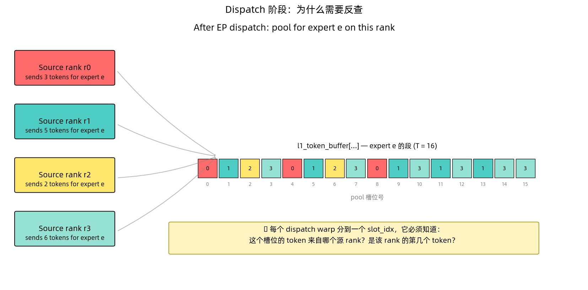
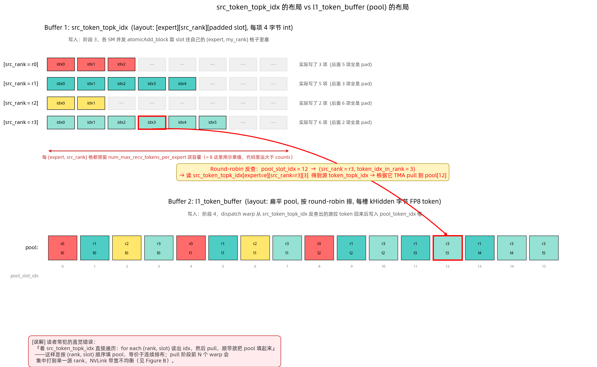
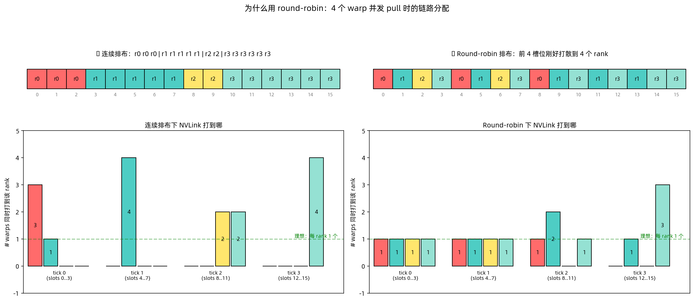
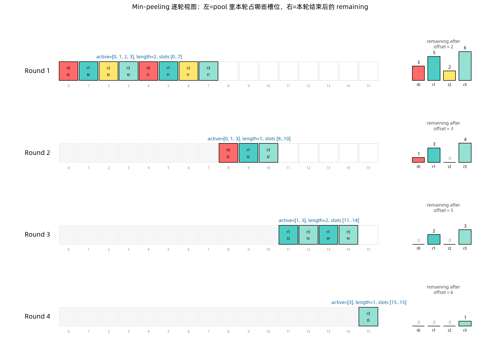
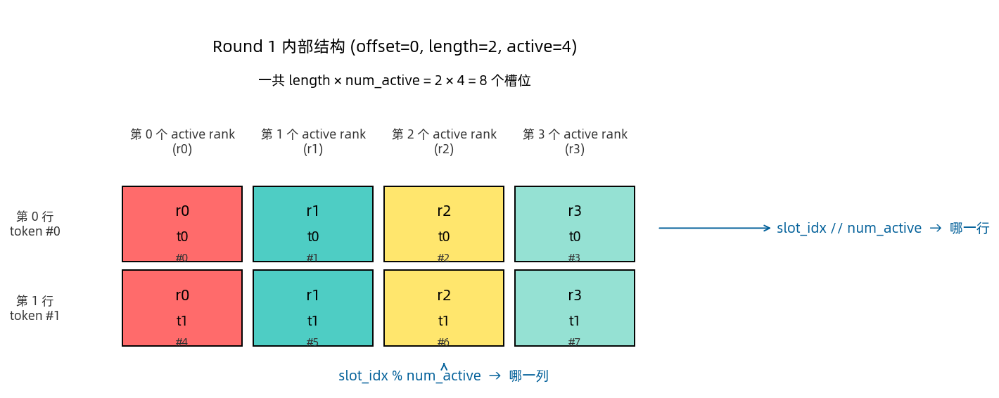
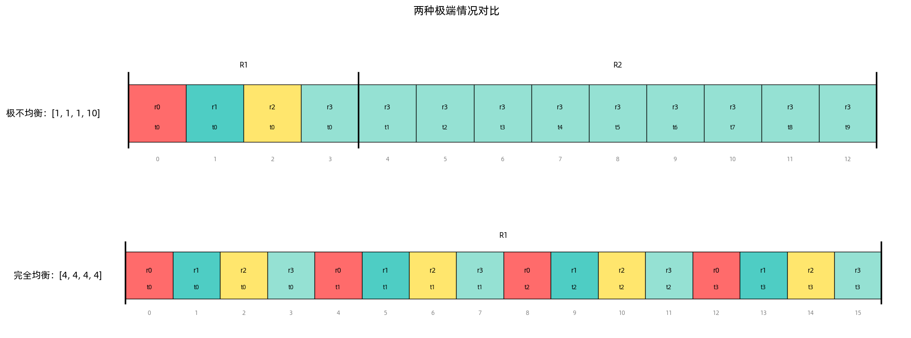
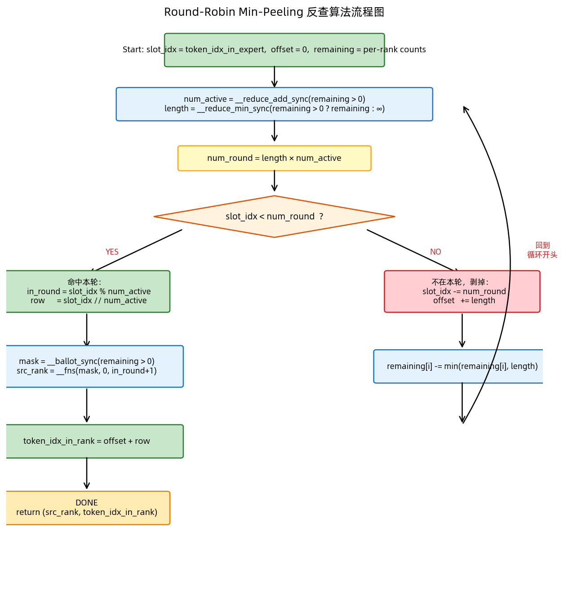
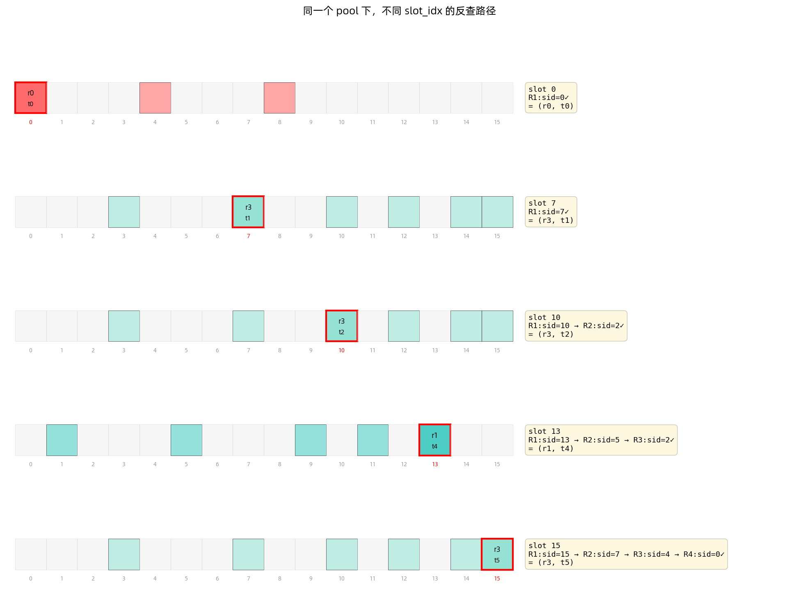
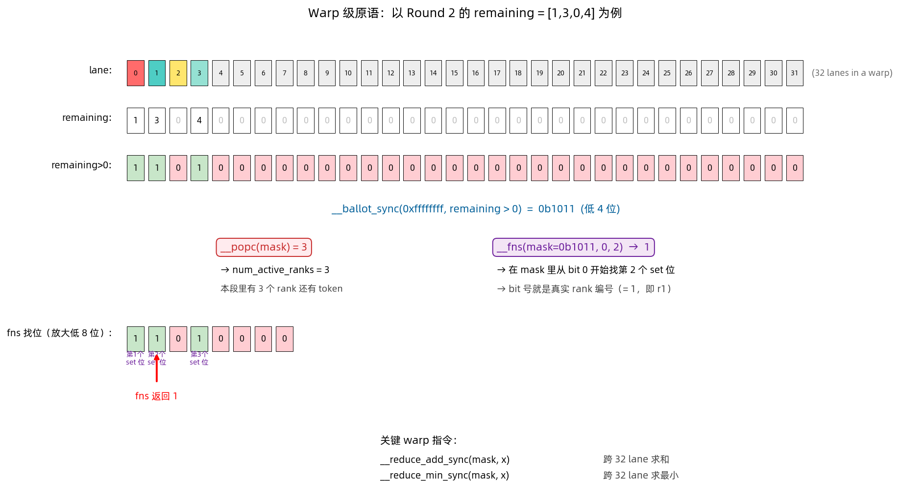
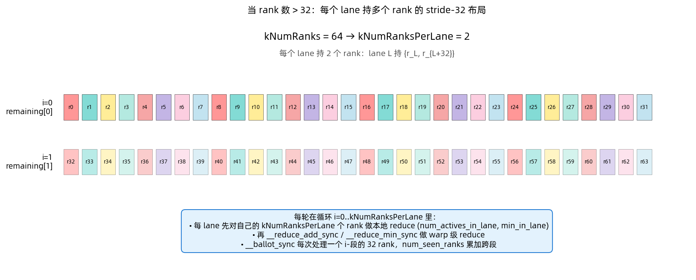

# Round-Robin Min-Peeling：Mega MoE Dispatch 的 pool 反查算法

> 解释 `deep_gemm/include/deep_gemm/impls/sm100_fp8_fp4_mega_moe.cuh:488-536`
> 的核心算法——dispatch 阶段每个 warp 独立地把 `pool_token_idx`
> 反推成 `(src_rank, token_idx_in_rank)`。

---

## 1. 背景：为什么需要这个算法

### 1.1 场景

经过 EP dispatch 后，本 rank 的某个 local expert `e` 收到了来自所有源 rank 的 token。
这些 token 被拼成一段连续的 "pool 段"，后续 L1 grouped GEMM 按 `BLOCK_M` 切分跑它。

假设本 expert 从 4 个源 rank 各收到这么多：

```
counts = [3, 5, 2, 6]    # r0→3, r1→5, r2→2, r3→6
T      = 16              # 本 expert 的 pool 段总长
```



### 1.2 核心问题

每个 dispatch warp 被分到一个 `slot_idx ∈ [0, T)`，它必须独立地回答：

> **"这个槽位的 token 来自哪个源 rank？是该 rank 的第几个 token？"**

要求：
- **不能查表**（没有显式存储过"slot → (rank, tok)"的数组）
- **不能和别的 warp 通信**（warp 分配是 `token_idx += kNumSMs * kNumDispatchWarps` 的大步长）
- **必须 O(1) 左右**（算法开销不能是 T 量级）

---

## 2. 两块 buffer：`src_token_topk_idx` vs `l1_token_buffer`

读到这里，一个很自然的直觉是：

> **"阶段 3 不是已经把源索引写进 `src_token_topk_idx` 了吗？阶段 4 直接从头到尾遍历它，读 `(rank, slot) → idx`，然后 pull，顺带就把 pool 填起来不就行？"**

这个直觉错在：**写源索引的那块 buffer 和最后要填的 pool 是两块不同 layout 的 buffer**。
直接遍历前者 = 按 (rank, slot) 顺序填 pool = **连续排布**，正是 §3 要极力避免的。

### 2.1 两块 buffer 的对比

| | `src_token_topk_idx` | `l1_token_buffer`（pool）|
|---|---|---|
| **存什么** | 一个 32-bit 整数 `src_token_idx * num_topk + src_topk` | 实际的 FP8 token 向量 |
| **每项字节** | 4 字节 | `kHidden` 字节 |
| **形状** | 3D：`[expert][src_rank][padded slot]` | 1D 扁平 `[kNumMaxPoolTokens]` |
| **排布** | 按 `src_rank` 分格 + 每格 pad 到上界 | round-robin 顺序 |
| **谁写** | **阶段 3**，**所有 rank 的 dispatch warp** 并发 atomicAdd_block | **阶段 4**，**本 rank** 的 dispatch warp 按反查结果写 |
| **谁读** | 阶段 4，本 rank 的 dispatch warp 反查后读 | 后续的 L1 GEMM |



### 2.2 为什么两块 buffer 不能合二为一

`src_token_topk_idx` 的 layout 是**写入方便**决定的：

- 阶段 3 很多 SM 并发写，每个 SM 只知道 `(dst_expert, dst_rank=自己)`，不知道最终 pool 里该排第几。
- 用 `atomicAdd_block(smem_expert_count[e], 1)` 取 slot，自然只能往"我自己这个源 rank 对应的格子"里顺序塞。
- 所以每个 `(expert, src_rank)` 格子必须**预留到上界大小**（`num_max_recv_tokens_per_expert`），后面全是 pad。

`l1_token_buffer`（pool）的 layout 是**读取方便**决定的：

- 阶段 4 之后要给 GEMM 吃，必须是**连续 BLOCK_M 对齐**的 token 流（grouped contiguous 布局）。
- 同时要让**并发 pull 带宽均衡**，所以排成 round-robin。

两者追求的目标不同，所以必须有一次 **"`(rank, slot)` → `pool_slot_idx`"的坐标变换**。
这个变换就是 round-robin min-peeling 要做的事。

### 2.3 衔接方式

阶段 4 稳态循环的数据流：

```
pool_slot_idx  ──(round-robin 反查)──►  (src_rank, token_idx_in_rank)
                                              │
                                              ▼
                                    src_token_topk_idx[e][src_rank][token_idx_in_rank]
                                              │
                                              ▼  (TMA 1D pull from source rank)
                                         l1_token_buffer[pool_slot_idx]
```

关键：
- `src_token_topk_idx` **只提供"源 token 是它那边的第几个"这一信息**，不决定 pool 顺序。
- pool 的顺序是**由 round-robin 反查主动安排的**，与 `src_token_topk_idx` 的物理布局无关。

其他 dispatch 相关 buffer 布局快速分类：

- **按 pool 布局**（大小 ~ `kNumMaxPoolTokens`，round-robin 顺序）：`l1_token_buffer`、`l1_sf_buffer`、`l1_topk_weights_buffer`、`token_src_metadata`
- **按 (expert, rank) 对齐 + pad**（dispatch 写入用）：`src_token_topk_idx`、`expert_recv_count`
- **按 expert 对齐**（counter 类）：`expert_send_count`、`expert_recv_count_sum`、`l1_arrival_count`、`l2_arrival_mask`

主线索：**"稳态被按 `pool_slot_idx` 并发访问 → round-robin；build-up 阶段各 SM 并发写 → 按 (expert, rank) 分格 + pad"**。

---

## 3. 排布设计：为什么是 round-robin

### 3.1 两种排布对比

最直观的排法是**连续**：同一 rank 的 token 放一起。
问题：pull 阶段多个 warp 并发按 slot_idx 拉数据时，**NVLink 带宽集中到一两条链路**。

Round-robin 则让前几个 slot 分散到不同 rank，并发时**带宽被打匀**：



上方对比槽位着色：连续排布前 3 个 slot 都是 r0，而 round-robin 的前 4 个 slot 是 r0 r1 r2 r3 全不同 rank。

下方的柱状图模拟：每 "tick" 4 个 warp 并发拉相邻 4 个 slot，柱子高度 = 该 rank 在这一 tick 被多少 warp 同时打到。
- **连续**：tick 1 的 4 个 warp 全部打到 r1，链路饱和；tick 3 全打 r3。
- **Round-robin**：tick 0、1 每个 rank 都被均匀打到 1 个 warp，最理想。

### 3.2 Min-peeling 处理不均衡

如果一直严格 round-robin，某些 rank 会先发完，剩下的 rank 还有 token，怎么办？

**Min-peeling**：每一轮让 active（还剩 token 的）rank 各发 `length = min(remaining)` 个。
这样最少那个 rank 的 token 正好被发完，下一轮它就从 active 集合退出。

看 Round 1：r2 最少（只有 2 个）→ 本轮所有 rank 各发 2 个 → r2 归零被 peel。



每轮的**左边**是本轮在 pool 里占哪些槽位，**右边**是本轮结束后的 remaining：

| Round | active | length | 槽位数 | 绝对 slot | offset |
|-------|--------|--------|--------|-----------|--------|
| 1 | `{r0,r1,r2,r3}` | 2 | 8 | 0..7 | 2 |
| 2 | `{r0,r1,r3}` | 1 | 3 | 8..10 | 3 |
| 3 | `{r1,r3}` | 2 | 4 | 11..14 | 5 |
| 4 | `{r3}` | 1 | 1 | 15 | 6 |

### 3.3 单轮内部的二维结构

一轮内部是**"先按 rank 轮转、再按 token 推进"**的二维填充：



Round 1 就是一个 `length=2` 行 × `num_active=4` 列的表格：
- 第 0 行：`r0t0, r1t0, r2t0, r3t0` → slot 0..3
- 第 1 行：`r0t1, r1t1, r2t1, r3t1` → slot 4..7

这个结构直接给了反查公式：
- **列**（挑 rank）= `slot_idx % num_active`
- **行**（挑 token）= `slot_idx // num_active`

### 3.4 极端情况看得更清楚



- 极不均衡 `[1,1,1,10]`：前 4 个 slot 分给 r0 r1 r2 r3，**剩下 9 个全是 r3**（r0/r1/r2 都只有 1 个，R1 length=1 就被全部 peel）。
- 完全均衡 `[4,4,4,4]`：永远只有一轮，`r0 r1 r2 r3` 循环 4 次就摆完。带宽利用率最理想。

---

## 4. 反查算法

**关键洞察**：§2 讲过，**pool 本身是虚拟的**——代码从不真正创建那个"按 round-robin 排好的数组"。
它只需要给定 `slot_idx`、`counts`，用循环反推出 `(src_rank, token_idx_in_rank)`，然后：
1. 拿 `(expert, src_rank, token_idx_in_rank)` 去索引物理存在的 `src_token_topk_idx`
2. 读到 `src_token_topk_idx` 后去源 rank 用 TMA pull 真正的 token
3. 把 token 写到 `l1_token_buffer[pool_slot_idx]`

### 4.1 伪代码

```python
remaining = counts[:]          # 每个 rank 的剩余计数
offset    = 0                  # active rank 们已经各发过多少个 token
slot_idx  = token_idx_in_expert

while True:
    active       = [r for r in range(num_ranks) if remaining[r] > 0]
    length       = min(remaining[r] for r in active)
    num_round    = length * len(active)

    if slot_idx < num_round:                     # 命中本轮
        in_round          = slot_idx %  len(active)   # 横向：本轮里第几个 active rank
        row_in_round      = slot_idx // len(active)   # 纵向：本轮里第几行
        src_rank          = active[in_round]
        token_idx_in_rank = offset + row_in_round
        break

    slot_idx -= num_round                        # 不在本轮，剥掉
    offset   += length
    remaining = [r - min(r, length) for r in remaining]
```

### 4.2 两个关键变量的语义

| 变量 | 初值 | 每轮更新 | 含义 |
|------|------|----------|------|
| `slot_idx` | `token_idx_in_expert` | `-= length * num_active` | 在**剩余未扫描段**里排第几 |
| `offset`   | `0`                    | `+= length`              | active rank 们**各自**已经发过多少 token |

两个指针在**相向夹逼**：`slot_idx` 从尾部往里缩，`offset` 从头部往前推。

### 4.3 为什么 `token_idx_in_rank = offset + row_in_round` 对任意命中的 rank 都成立？

min-peeling 保证**一轮内所有 active rank 步调一致**：每个 rank 本轮都发 `length` 个。
所以本轮结束时，每个 active rank 发出去的 token 数**都相等 = `offset`**。
`offset` 不依赖命中的是哪个 rank，只要它在 active 集合里，它"已发到哪"就等于 `offset`。

### 4.4 流程图



---

## 5. 逐 slot 反查演示

下面 5 个例子覆盖 4 个 round 的不同命中情况：



**`slot=0`** → Round 1 一次命中 `(r0, t0)`，最简单情况。

**`slot=7`** → Round 1 末尾命中 `(r3, t1)`。Round 1 是 `2×4=8` 个槽位，slot 7 是最后一个。

**`slot=10`** → Round 1 跳过（sid=10→2），Round 2 命中 `(r3, t2)`。
注意 Round 2 active=`{r0,r1,r3}` 不连续，`in_round=2` 要映射到 **active 列表里第 3 个**，即 r3，不是 r2（r2 已被 peel）。

**`slot=13`** → 跨 3 个 round。Round 1 跳（sid 13→5），Round 2 跳（sid 5→2），Round 3 命中 `(r1, t4)`。

**`slot=15`** → 最后一个 slot，要跳过 3 个 round 才命中 Round 4 的 `(r3, t5)`。

### 5.1 完整追踪：`slot_idx = 12`

```
初始: slot_idx=12, offset=0, remaining=[3,5,2,6]

Round 1:
  active=4, length=min(3,5,2,6)=2, num_round=2*4=8
  slot_idx=12 >= 8  不在本轮，跳过
  slot_idx -= 8  →  4
  offset   += 2  →  2
  remaining       →  [1,3,0,4]        # r2 被 peel

Round 2:
  active=3 {r0,r1,r3}, length=min(1,3,4)=1, num_round=1*3=3
  slot_idx=4 >= 3   不在本轮，跳过
  slot_idx -= 3  →  1
  offset   += 1  →  3
  remaining       →  [0,2,0,3]        # r0 被 peel

Round 3:
  active=2 {r1,r3}, length=min(2,3)=2, num_round=2*2=4
  slot_idx=1 < 4    命中 ✓
    in_round     = 1 % 2 = 1            →  active[1] = r3
    row_in_round = 1 // 2 = 0
    token_idx_in_rank = offset + 0 = 3
```

结论：**slot 12 = (r3, r3 的第 3 个 token)**。

---

## 6. C++ 实现：warp 并行

上面的循环每轮要算 `num_active` / `length` / "第 n 个 active rank"——都用 warp 级 SIMD 原语一次搞定：

### 6.1 Warp 原语可视化



图中状态是 Round 2 的 `remaining = [1,3,0,4]`（lane 0..3 各持一个 rank 的剩余）：

- **第 1 行**：32 个 lane（前 4 个对应 r0..r3）
- **第 2 行**：每 lane 存的 `remaining` 值
- **第 3 行**：`remaining > 0` 的布尔值（绿=1，红=0）

三条 warp 指令的作用：
- `__popc(mask) = 3` → `num_active_ranks = 3`（r0, r1, r3 active）
- `__ballot_sync(..., remaining > 0) = 0b1011` → 活跃 rank 位图
- `__fns(0b1011, 0, 2) = 1` → mask 里**从 bit 0 起第 2 个 set 位**的位号 = 1 = r1

**`__fns` 的直观理解**（图底部）：把 mask 看成"第 1 个 set 位、第 2 个 set 位、第 3 个 set 位"的序列，`__fns(mask, 0, n)` 返回第 n 个的位号。位号就是真实 rank 编号。

### 6.2 完整 C++ 代码

```cpp
// lane L 持 ranks {L, L+32, L+64, ...} 的 remaining
uint32_t remaining[kNumRanksPerLane];
for (uint32_t i = 0; i < kNumRanksPerLane; ++ i)
    remaining[i] = stored_rank_count[i];

uint32_t offset   = 0;
uint32_t slot_idx = token_idx_in_expert;
uint32_t current_rank_in_expert_idx, token_idx_in_rank;

while (true) {
    // ── 计算 num_active 和 length ───────────────────────────
    uint32_t num_actives_in_lane = 0;
    uint32_t min_in_lane         = 0xffffffff;
    #pragma unroll
    for (uint32_t i = 0; i < kNumRanksPerLane; ++ i) {
        num_actives_in_lane += remaining[i] > 0;
        if (remaining[i] > 0)
            min_in_lane = cute::min(min_in_lane, remaining[i]);
    }
    const uint32_t num_active_ranks = __reduce_add_sync(0xffffffff, num_actives_in_lane);
    const uint32_t length           = __reduce_min_sync(0xffffffff, min_in_lane);
    const uint32_t num_round_tokens = length * num_active_ranks;

    // ── 命中本轮 ───────────────────────────────────────────
    if (slot_idx < num_round_tokens) {
        const uint32_t slot_idx_in_round = slot_idx % num_active_ranks;

        uint32_t num_seen_ranks = 0;
        current_rank_in_expert_idx = 0;
        #pragma unroll
        for (uint32_t i = 0; i < kNumRanksPerLane; ++ i) {
            const uint32_t mask             = __ballot_sync(0xffffffff, remaining[i] > 0);
            const uint32_t num_active_lanes = __popc(mask);
            if (slot_idx_in_round >= num_seen_ranks
                and slot_idx_in_round < num_seen_ranks + num_active_lanes)
                current_rank_in_expert_idx =
                    i * 32 + __fns(mask, 0, slot_idx_in_round - num_seen_ranks + 1);
            num_seen_ranks += num_active_lanes;
        }
        token_idx_in_rank = offset + (slot_idx / num_active_ranks);
        break;
    }

    // ── 剥本轮 ─────────────────────────────────────────────
    slot_idx -= num_round_tokens;
    offset   += length;
    #pragma unroll
    for (uint32_t i = 0; i < kNumRanksPerLane; ++ i)
        remaining[i] -= cute::min(remaining[i], length);
}
```

### 6.3 `kNumRanksPerLane > 1`：多 rank per lane

当 `kNumRanks > 32`（跨节点部署，比如 64 GPU）时，一个 warp 32 lane 不够装所有 rank，
每 lane 要持 `ceil(num_ranks/32)` 个 rank 的状态：



- lane L 持 `{rL, rL+32, rL+64, ...}`
- `remaining[0]` 是 lane 段 `[0..31]`，`remaining[1]` 是 `[32..63]`

外层循环 `for (i = 0; i < kNumRanksPerLane; ++i)` 分段处理：
- **本地 reduce**：每 lane 先在自己的 `kNumRanksPerLane` 个 rank 上求 active 数和 min
- **warp 级 reduce**：再用 `__reduce_add_sync` / `__reduce_min_sync` 跨 32 lane
- **ballot 分段**：`__ballot_sync` 每次给一个 32-rank 段位图，外层用 `num_seen_ranks` 累加跨段已计数的 active 数

你当前 4~8 rank 配置下 `kNumRanksPerLane = 1`，内外层循环都退化为 "每 lane 恰好一个 rank" 的简洁情况。

---

## 7. 小结

1. **两块 buffer 分工**：`src_token_topk_idx` 按 `(expert, src_rank)` 分格 + pad，适合阶段 3 多 SM 并发原子写；
   `l1_token_buffer` 扁平 pool 按 round-robin 排，适合阶段 4 多 warp 并发 pull。
   两块 buffer layout 不同，之间通过 round-robin 反查做坐标变换。

2. **排布设计**：round-robin + min-peeling 把前几个 slot 分散到不同源 rank，保证 pull
   阶段 NVLink 带宽打匀；每轮用 `length = min(remaining)` 削减，最少那个 rank 刚好被削光退出。

3. **反查函数**：给 `slot_idx` 回 `(src_rank, token_idx_in_rank)`：
   - 每轮判断 `slot_idx < length × num_active`
   - 命中：`slot_idx % num_active` 挑列 → rank，`offset + slot_idx // num_active` 挑行 → token
   - 未命中：扣掉 `num_round_tokens`，offset += length，削 active 集合

4. **这套算法为何值得搞这么复杂**：
   - 每个 warp **完全独立**完成反查，不需要 smem 表、不需要 warp 间同步
   - 每轮只花 3~4 条 warp 级指令（`__reduce_add/min_sync`、`__ballot_sync`、`__fns`、`__popc`）
   - 运行时间 = 轮数 × O(1)，轮数上界 = rank 数（实际因为每轮至少 peel 掉一个 rank，平均更小）
   - **把"均衡排布"和"O(1) 反查"同时做到了**
