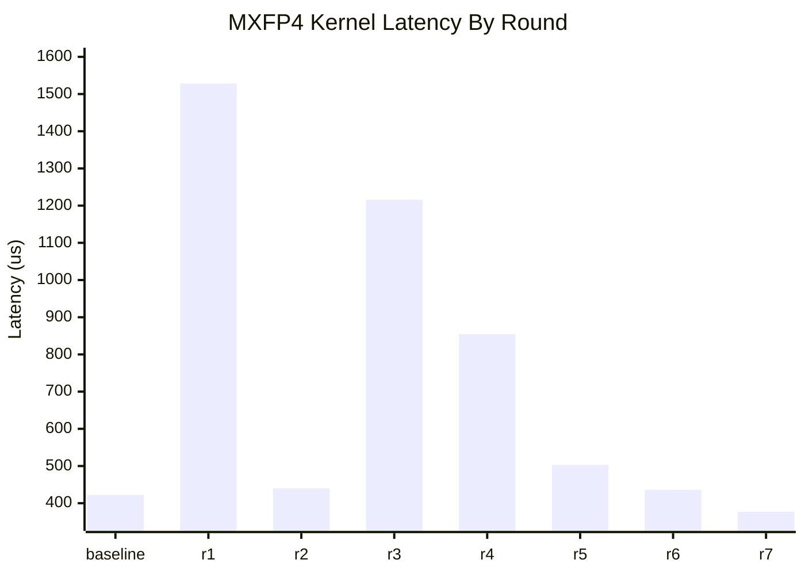

# MXFP4 Grouped GEMM Perf Log

## Workload

- `L=32`
- `m_per_expert=1024`
- `m_total=32768`
- `n=2048`
- `k=7168`
- path: explicit `use_mxfp4=True`
- layout: grouped contiguous

## Measurement Protocol

- correctness first, performance second
- correctness metric: `calc_diff` against BF16 reference
- timing metric: CUDA events, `20` warmup + `100` timed iterations
- reported number: steady-state average latency in `us`
- all optimization rounds modify exactly one code point at a time
- from `r5` onward, benchmarks are pinned to idle `GPU1` because `GPU0` became externally contended by `VLLM::EngineCore`

## Performance Chart

## Round Log

| Round | Change | Correctness | Perf (us) | Delta vs Baseline | Result |
| --- | --- | --- | ---: | ---: | --- |
| baseline | `block_n=112`, auto-selected `num_stages=3`, `num_sms=148` | `calc_diff=0.01337715`, `cos=0.98669684`, `max_abs_diff=82.5` | `422.55` | `0.00` | baseline |
| r1 | cap MXFP4 `num_stages<=2` in `SM100ArchSpec::is_num_stages_legal()` | `calc_diff=0.01337920`, `cos=0.98669475`, `max_abs_diff=82.5` | `1528.36` | `+1105.81` | reject |
| r2 | cap MXFP4 `num_sms<=144` after config selection | `calc_diff=0.01337715`, `cos=0.98669684`, `max_abs_diff=82.5` | `440.04` | `+17.49` | reject |
| r3 | force MXFP4 `block_n=96` | `calc_diff=0.01337715`, `cos=0.98669684`, `max_abs_diff=82.5` | `1215.67` | `+793.12` | reject |
| r4 | request `preferred shared-memory carveout=100` in kernel launch config | `calc_diff=0.01337715`, `cos=0.98669684`, `max_abs_diff=82.5` | `854.76` | `+432.21` | reject |
| r5 | force `kNumTMAStoreStages=1` in MXFP4 kernel | `calc_diff=0.01337715`, `cos=0.98669684`, `max_abs_diff=82.5` | `503.09` | `+80.54` | reject |
| r6 | force `kNumEpilogueStages=1` in MXFP4 kernel | `calc_diff=0.01337715`, `cos=0.98669684`, `max_abs_diff=82.5` | `436.17` | `+13.62` | reject |
| r7 | reopen `block_n=128` by pairing MXFP4 `1-stage CD store` with matching host-side `smem_cd` estimate | `calc_diff=0.01337715`, `cos=0.98669684`, `max_abs_diff=82.5` | `376.98` | `-45.57` | accept |

## Exploratory Reference

These were measured before the formal loop and are kept here only as context.

| Config | Stages | Perf (us) | Notes |
| --- | ---: | ---: | --- |
| `block_n=48` | `4` | `628.13` | slower despite higher stage count |
| `block_n=64` | `3` | `614.88` | slower; `swizzle_cd` stayed at `128B` |
| `block_n=112` | `3` | `422.55` | current baseline |
