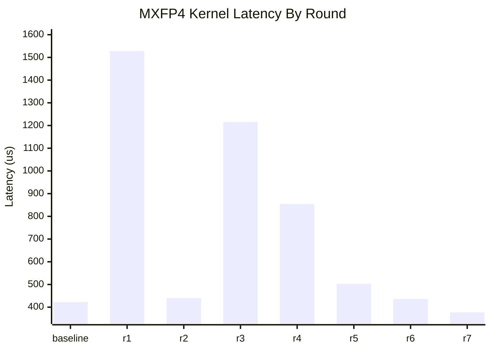
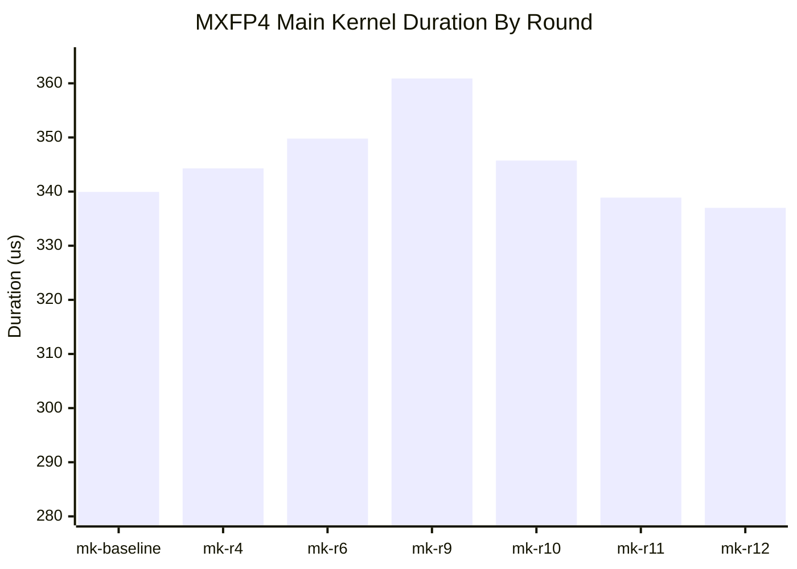

# MXFP4 Grouped GEMM Perf Log

## Workload

- `L=32`
- `m_per_expert=1024`
- `m_total=32768`
- `n=2048`
- `k=7168`
- path: explicit `use_mxfp4=True`
- layout: grouped contiguous

## Measurement Protocol

- correctness first, performance second
- correctness metric: `calc_diff` against BF16 reference
- timing metric: CUDA events, `20` warmup + `100` timed iterations
- reported number: steady-state average latency in `us`
- all optimization rounds modify exactly one code point at a time
- from `r5` onward, benchmarks are pinned to idle `GPU1` because `GPU0` became externally contended by `VLLM::EngineCore`

## Performance Chart

## Round Log

| Round | Change | Correctness | Perf (us) | Delta vs Baseline | Result |
| --- | --- | --- | ---: | ---: | --- |
| baseline | `block_n=112`, auto-selected `num_stages=3`, `num_sms=148` | `calc_diff=0.01337715`, `cos=0.98669684`, `max_abs_diff=82.5` | `422.55` | `0.00` | baseline |
| r1 | cap MXFP4 `num_stages<=2` in `SM100ArchSpec::is_num_stages_legal()` | `calc_diff=0.01337920`, `cos=0.98669475`, `max_abs_diff=82.5` | `1528.36` | `+1105.81` | reject |
| r2 | cap MXFP4 `num_sms<=144` after config selection | `calc_diff=0.01337715`, `cos=0.98669684`, `max_abs_diff=82.5` | `440.04` | `+17.49` | reject |
| r3 | force MXFP4 `block_n=96` | `calc_diff=0.01337715`, `cos=0.98669684`, `max_abs_diff=82.5` | `1215.67` | `+793.12` | reject |
| r4 | request `preferred shared-memory carveout=100` in kernel launch config | `calc_diff=0.01337715`, `cos=0.98669684`, `max_abs_diff=82.5` | `854.76` | `+432.21` | reject |
| r5 | force `kNumTMAStoreStages=1` in MXFP4 kernel | `calc_diff=0.01337715`, `cos=0.98669684`, `max_abs_diff=82.5` | `503.09` | `+80.54` | reject |
| r6 | force `kNumEpilogueStages=1` in MXFP4 kernel | `calc_diff=0.01337715`, `cos=0.98669684`, `max_abs_diff=82.5` | `436.17` | `+13.62` | reject |
| r7 | reopen `block_n=128` by pairing MXFP4 `1-stage CD store` with matching host-side `smem_cd` estimate | `calc_diff=0.01337715`, `cos=0.98669684`, `max_abs_diff=82.5` | `376.98` | `-45.57` | accept |

## Exploratory Reference

These were measured before the formal loop and are kept here only as context.

| Config | Stages | Perf (us) | Notes |
| --- | ---: | ---: | --- |
| `block_n=48` | `4` | `628.13` | slower despite higher stage count |
| `block_n=64` | `3` | `614.88` | slower; `swizzle_cd` stayed at `128B` |
| `block_n=112` | `3` | `422.55` | current baseline |

## Main Kernel Target

- objective switched to main kernel only
- target: `300 us`
- measurement source: NCU `Duration` for `sm100_mxfp4_gemm_1d1d_impl`

### Main Kernel Chart

### Main Kernel Round Log

| Round | Change | Correctness | Main Kernel Perf (us) | Result |
| --- | --- | --- | ---: | --- |
| mk-baseline | current accepted config `block_n=128`, `stages=3` | `calc_diff=0.01337715`, `cos=0.98669684`, `max_abs_diff=82.5` | `339.94` | baseline |
| mk-r1 | force MXFP4 `block_n=192` | `calc_diff=0.08014280`, `cos=0.91986656`, `max_abs_diff=455.25` | `n/a` | reject: correctness fail |
| mk-r2 | reduce SM100 MXFP4 non-epilogue threads from `128` to `96` | `calc_diff=0.99995519`, `cos=0.00004481`, `max_abs_diff=720.0` | `n/a` | reject: correctness fail |
| mk-r3 | retry `block_n=192` with SFB TMA tile width aligned to `128` | `n/a` | `n/a` | reject: runtime hang / deadlock |
| mk-r4 | derive SFA/SFB TMEM column counts from CUTLASS fragment/layout instead of fixed `14/30` | `calc_diff=0.01337715`, `cos=0.98669684`, `max_abs_diff=82.5` | `344.29` | reject: slower than baseline |
| mk-r5 | force MXFP4 `block_k=128` | `n/a` | `n/a` | reject: JIT compile failed; current MXFP4 TMA/UMMA layout requires `BLOCK_K=256` |
| mk-r6 | align MXFP4 SF transpose/fence ordering with FP8 kernel | `calc_diff=0.01337715`, `cos=0.98669684`, `max_abs_diff=82.5` | `349.79` | reject: slower than baseline |
| mk-r7 | add minimal `block_n=192` SFB special handling: aligned SFB TMA tile, wider SFB load, odd-tile TMEM offset | `calc_diff=0.04954704`, `cos=0.95132226`, `max_abs_diff=201.0` | `n/a` | reject: correctness fail; N192 support still incomplete |
| mk-r8 | retry `block_n=192` with CUTLASS-inspired parity-aware SFB placement into the 256-wide buffer | `calc_diff=0.04288156`, `cos=0.95730627`, `max_abs_diff=308.0` | `n/a` | reject: correctness fail; still missing full CUTLASS SFB reshape semantics |
| mk-r9 | set MXFP4 A/B TMA descriptor `L2 promotion` from `L2_256B` to `NONE` | `calc_diff=0.01337715`, `cos=0.98669684`, `max_abs_diff=82.5` | `360.90` | reject: slower than baseline |
| mk-r10 | keep MXFP4 B TMA descriptor at `L2_256B`, set only A TMA descriptor `L2 promotion` to `NONE` | `calc_diff=0.01337715`, `cos=0.98669684`, `max_abs_diff=82.5` | `345.73` | reject: slower than baseline |
| mk-r11 | force explicit MXFP4 grouped-contiguous dispatch to use `compiled_dims=''` instead of inheriting the generic `nk` default | `calc_diff=0.01337715`, `cos=0.98669684`, `max_abs_diff=82.5` | `338.88` | reject: gain stayed within noise floor; same-GPU control probe with explicit `nk` was `337.98` |
| mk-r12 | set per-kernel launch cache config to `PreferShared` in the JIT launch handle; NCU confirmed `launch__func_cache_config=CachePreferShared` | `calc_diff=0.01337715`, `cos=0.98669684`, `max_abs_diff=82.5` | `336.99` | accept: repeated NCU runs were `337.15` and `336.83` |
