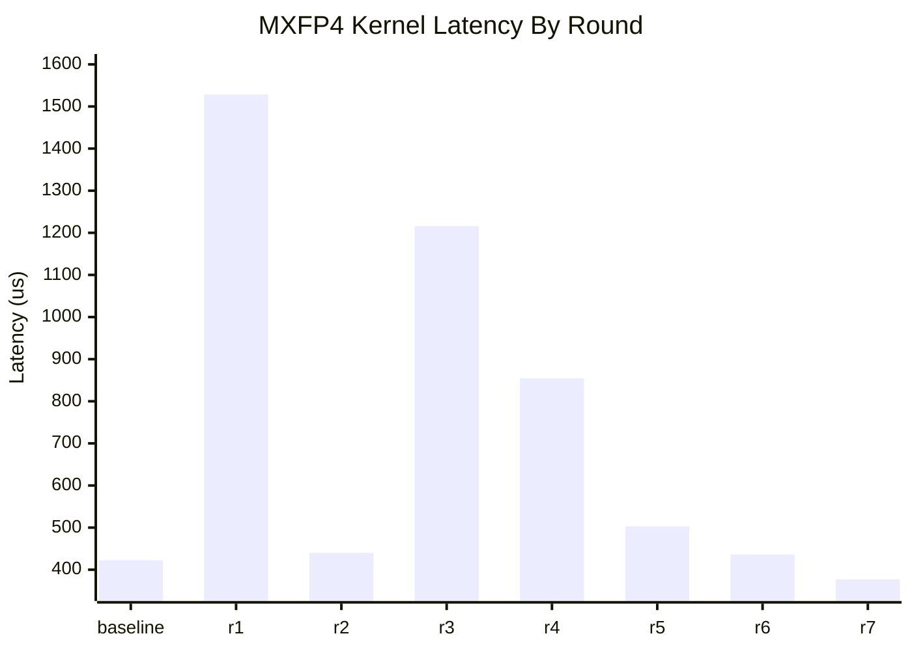
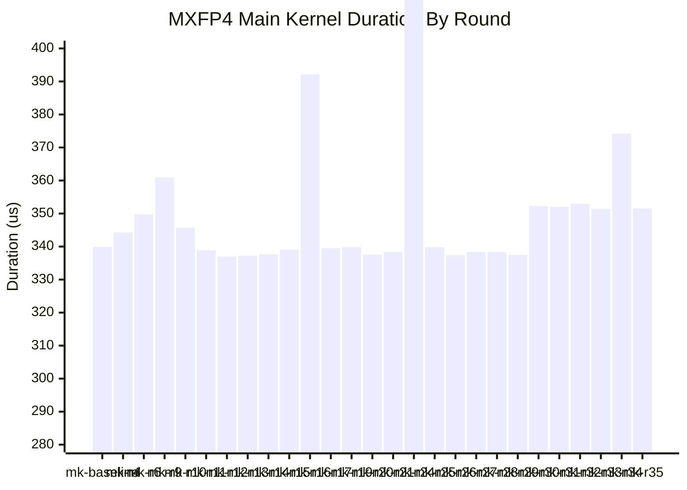

# MXFP4 Grouped GEMM Perf Log

## Workload

- `L=32`
- `m_per_expert=1024`
- `m_total=32768`
- `n=2048`
- `k=7168`
- path: explicit `use_mxfp4=True`
- layout: grouped contiguous

## Measurement Protocol

- correctness first, performance second
- correctness metric: `calc_diff` against BF16 reference
- timing metric: CUDA events, `20` warmup + `100` timed iterations
- reported number: steady-state average latency in `us`
- all optimization rounds modify exactly one code point at a time
- from `r5` onward, benchmarks are pinned to idle `GPU1` because `GPU0` became externally contended by `VLLM::EngineCore`

## Performance Chart

## Round Log

| Round | Change | Correctness | Perf (us) | Delta vs Baseline | Result |
| --- | --- | --- | ---: | ---: | --- |
| baseline | `block_n=112`, auto-selected `num_stages=3`, `num_sms=148` | `calc_diff=0.01337715`, `cos=0.98669684`, `max_abs_diff=82.5` | `422.55` | `0.00` | baseline |
| r1 | cap MXFP4 `num_stages<=2` in `SM100ArchSpec::is_num_stages_legal()` | `calc_diff=0.01337920`, `cos=0.98669475`, `max_abs_diff=82.5` | `1528.36` | `+1105.81` | reject |
| r2 | cap MXFP4 `num_sms<=144` after config selection | `calc_diff=0.01337715`, `cos=0.98669684`, `max_abs_diff=82.5` | `440.04` | `+17.49` | reject |
| r3 | force MXFP4 `block_n=96` | `calc_diff=0.01337715`, `cos=0.98669684`, `max_abs_diff=82.5` | `1215.67` | `+793.12` | reject |
| r4 | request `preferred shared-memory carveout=100` in kernel launch config | `calc_diff=0.01337715`, `cos=0.98669684`, `max_abs_diff=82.5` | `854.76` | `+432.21` | reject |
| r5 | force `kNumTMAStoreStages=1` in MXFP4 kernel | `calc_diff=0.01337715`, `cos=0.98669684`, `max_abs_diff=82.5` | `503.09` | `+80.54` | reject |
| r6 | force `kNumEpilogueStages=1` in MXFP4 kernel | `calc_diff=0.01337715`, `cos=0.98669684`, `max_abs_diff=82.5` | `436.17` | `+13.62` | reject |
| r7 | reopen `block_n=128` by pairing MXFP4 `1-stage CD store` with matching host-side `smem_cd` estimate | `calc_diff=0.01337715`, `cos=0.98669684`, `max_abs_diff=82.5` | `376.98` | `-45.57` | accept |

## Exploratory Reference

These were measured before the formal loop and are kept here only as context.

| Config | Stages | Perf (us) | Notes |
| --- | ---: | ---: | --- |
| `block_n=48` | `4` | `628.13` | slower despite higher stage count |
| `block_n=64` | `3` | `614.88` | slower; `swizzle_cd` stayed at `128B` |
| `block_n=112` | `3` | `422.55` | current baseline |

## Main Kernel Target

- objective switched to main kernel only
- target: `300 us`
- measurement source: NCU `Duration` for `sm100_mxfp4_gemm_1d1d_impl`

### Main Kernel Chart

### Main Kernel Round Log

| Round | Change | Correctness | Main Kernel Perf (us) | Result |
| --- | --- | --- | ---: | --- |
| mk-baseline | current accepted config `block_n=128`, `stages=3` | `calc_diff=0.01337715`, `cos=0.98669684`, `max_abs_diff=82.5` | `339.94` | baseline |
| mk-r1 | force MXFP4 `block_n=192` | `calc_diff=0.08014280`, `cos=0.91986656`, `max_abs_diff=455.25` | `n/a` | reject: correctness fail |
| mk-r2 | reduce SM100 MXFP4 non-epilogue threads from `128` to `96` | `calc_diff=0.99995519`, `cos=0.00004481`, `max_abs_diff=720.0` | `n/a` | reject: correctness fail |
| mk-r3 | retry `block_n=192` with SFB TMA tile width aligned to `128` | `n/a` | `n/a` | reject: runtime hang / deadlock |
| mk-r4 | derive SFA/SFB TMEM column counts from CUTLASS fragment/layout instead of fixed `14/30` | `calc_diff=0.01337715`, `cos=0.98669684`, `max_abs_diff=82.5` | `344.29` | reject: slower than baseline |
| mk-r5 | force MXFP4 `block_k=128` | `n/a` | `n/a` | reject: JIT compile failed; current MXFP4 TMA/UMMA layout requires `BLOCK_K=256` |
| mk-r6 | align MXFP4 SF transpose/fence ordering with FP8 kernel | `calc_diff=0.01337715`, `cos=0.98669684`, `max_abs_diff=82.5` | `349.79` | reject: slower than baseline |
| mk-r7 | add minimal `block_n=192` SFB special handling: aligned SFB TMA tile, wider SFB load, odd-tile TMEM offset | `calc_diff=0.04954704`, `cos=0.95132226`, `max_abs_diff=201.0` | `n/a` | reject: correctness fail; N192 support still incomplete |
| mk-r8 | retry `block_n=192` with CUTLASS-inspired parity-aware SFB placement into the 256-wide buffer | `calc_diff=0.04288156`, `cos=0.95730627`, `max_abs_diff=308.0` | `n/a` | reject: correctness fail; still missing full CUTLASS SFB reshape semantics |
| mk-r9 | set MXFP4 A/B TMA descriptor `L2 promotion` from `L2_256B` to `NONE` | `calc_diff=0.01337715`, `cos=0.98669684`, `max_abs_diff=82.5` | `360.90` | reject: slower than baseline |
| mk-r10 | keep MXFP4 B TMA descriptor at `L2_256B`, set only A TMA descriptor `L2 promotion` to `NONE` | `calc_diff=0.01337715`, `cos=0.98669684`, `max_abs_diff=82.5` | `345.73` | reject: slower than baseline |
| mk-r11 | force explicit MXFP4 grouped-contiguous dispatch to use `compiled_dims=''` instead of inheriting the generic `nk` default | `calc_diff=0.01337715`, `cos=0.98669684`, `max_abs_diff=82.5` | `338.88` | reject: gain stayed within noise floor; same-GPU control probe with explicit `nk` was `337.98` |
| mk-r12 | set per-kernel launch cache config to `PreferShared` in the JIT launch handle; NCU confirmed `launch__func_cache_config=CachePreferShared` | `calc_diff=0.01337715`, `cos=0.98669684`, `max_abs_diff=82.5` | `336.99` | accept: repeated NCU runs were `337.15` and `336.83` |
| mk-r13 | switch per-kernel launch cache config from `PreferShared` to `PreferEqual` | `calc_diff=0.01337715` | `337.25` | reject: repeated NCU runs diverged to `336.54` and `337.95`; average regressed vs `mk-r12` |
| mk-r14 | force explicit MXFP4 grouped-contiguous dispatch back to `compiled_dims=''` while keeping the accepted `PreferShared` launch cache config | `1 passed, 7 deselected` | `337.63` | reject: same knob stayed slower than the `mk-r12` baseline on GPU2 |
| mk-r15 | force explicit MXFP4 grouped-contiguous dispatch to compile `m/n/k` as static template dimensions (`compiled_dims=\"mnk\"`) | `1 passed, 7 deselected` | `339.04` | reject: fully static shape specialization regressed the main kernel on GPU2 |
| mk-r16 | clamp explicit MXFP4 grouped-contiguous `num_sms` from the full device count down to `128` following CUTLASS-style `max_sm_count` tuning | `1 passed, 7 deselected` | `392.10` | reject: grid dropped to `128` as intended, but under-filled the persistent schedule and regressed badly |
| mk-r17 | force NVCC JIT target from Blackwell family `sm_100f` back to exact `sm_100a` for this runtime codegen path | `1 passed, 7 deselected` | `339.52` | reject: exact-arch codegen produced slower SASS than the family target |
| mk-r18 | switch the JIT compiler default from `NVCC` to `NVRTC` | `compile fail` | `n/a` | reject: NVRTC could not find `cuda/std/cstdint` in the current include path setup, so this backend cannot be evaluated as-is |
| mk-r19 | set `PreferredSharedMemoryCarveout=100` on top of the accepted `CachePreferShared` launch config | `1 passed, 7 deselected` | `339.84` | reject: explicit carveout did not improve over the existing `PreferShared` baseline |
| mk-r20 | remove the global `ptxas --register-usage-level=10` flag to give the compiler more register/scheduling freedom | `1 passed, 7 deselected` | `337.54` | reject: repeated NCU runs were `337.73` and `337.34`, and register usage rose to `51/thread` without beating `mk-r12` |
| mk-r21 | fully enable the NVRTC backend by adding the missing `cccl` include path and switching the default JIT compiler to `NVRTC` | `1 passed, 7 deselected` | `338.30` | reject: NVRTC became functional, but the generated kernel still regressed vs the accepted NVCC baseline |
| mk-r22 | increase MXFP4 grouped-contiguous non-epilogue threads from `128` to `160` while keeping epilogue threads at the required `128` | `calc_diff=1.01035` | `n/a` | reject: correctness failed hard, so higher producer/compute thread count is not viable in this kernel |
| mk-r23 | force MXFP4 grouped-contiguous `block_n=112` while keeping the current kernel implementation and launch policy unchanged | `1 passed, 7 deselected` | `383.17` | reject: the smaller `N` tile preserved `3` stages but caused a large main-kernel regression |
| mk-r24 | force MXFP4 grouped-contiguous `block_n=96` while keeping the current kernel implementation and launch policy unchanged | `1 passed, 7 deselected` | `427.62` | reject: shrinking the `N` tile further caused an even larger main-kernel regression |
| mk-r25 | change explicit MXFP4 grouped-contiguous shape specialization from the default `nk` to only `k` | `1 passed, 7 deselected` | `339.81` | reject: dropping `n` specialization regressed the main kernel |
| mk-r26 | change explicit MXFP4 grouped-contiguous shape specialization from the default `nk` to only `n` | `1 passed, 7 deselected` | `337.38` | reject: removing `k` specialization still failed to beat the accepted `nk` baseline |
| mk-r27 | set per-kernel shared-memory bank size preference to `8-byte` on both runtime and driver launch paths | `1 passed, 7 deselected` | `338.30` | reject: the bank-width override remained slower than the accepted baseline |
| mk-r28 | switch the per-kernel cache preference from `PreferShared` to `PreferL1` | `1 passed, 7 deselected` | `338.37` | reject: `CachePreferL1` stayed slower than the accepted `PreferShared` baseline |
| mk-r29 | change explicit MXFP4 grouped-contiguous shape specialization from the default `nk` to `mn` | `1 passed, 7 deselected` | `337.44` | reject: specializing `m/n` produced a different template instantiation but still regressed vs `mk-r12` |
| mk-r30 | add launch-level `PreferredSharedMemoryCarveout=100` on top of the accepted `CachePreferShared` baseline | `1 passed, 7 deselected` | `352.29` | reject: launch-attribute carveout overrode the baseline policy and regressed badly |
| mk-r31 | add NVCC `--extra-device-vectorization` to the JIT compiler flags | `1 passed, 7 deselected` | `352.06` | reject: the extra vectorization pass increased register pressure to `51/thread` and regressed badly |
| mk-r32 | change explicit MXFP4 grouped-contiguous shape specialization from the default `nk` to only `m` | `1 passed, 7 deselected` | `352.93` | reject: specializing only `m` produced the worst of the recent shape-specialization variants |
| mk-r33 | add launch-level `access policy window` to mark the MXFP4 grouped `A` tensor as streaming | `1 passed, 7 deselected` | `351.42` | reject: the L2 streaming hint was directionally better than the recent `352+ us` regressions, but still far below the accepted baseline |
| mk-r34 | set persisting L2 cache to the device max and mark the MXFP4 grouped `B` tensor as persisting | `1 passed, 7 deselected` | `374.18` | reject: NCU confirmed `launch__persisting_l2_cache_size=82.9 MB`, but the persisting hint heavily regressed this workload |
| mk-r35 | set `cudaLimitMaxL2FetchGranularity=128` before the explicit MXFP4 grouped launch | `1 passed, 7 deselected` | `351.55` | reject: the L2 fetch granularity hint had no useful effect and remained far slower than the accepted baseline |
